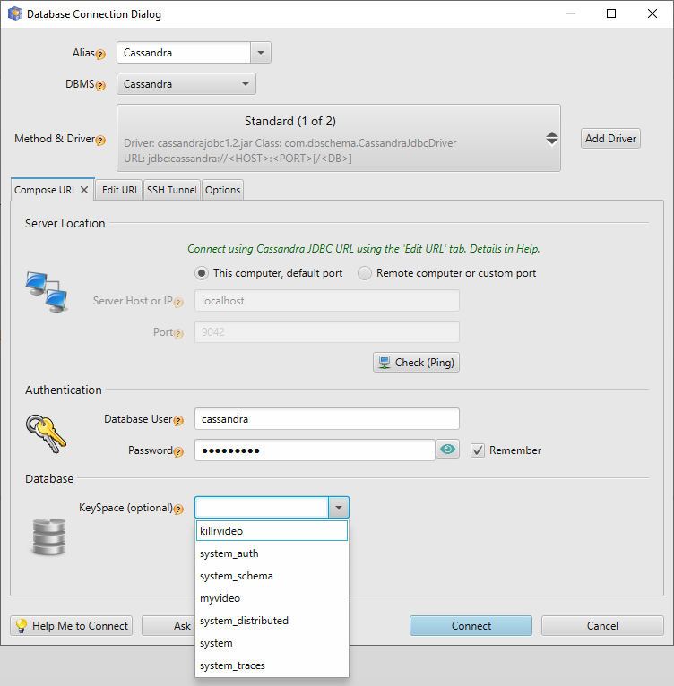
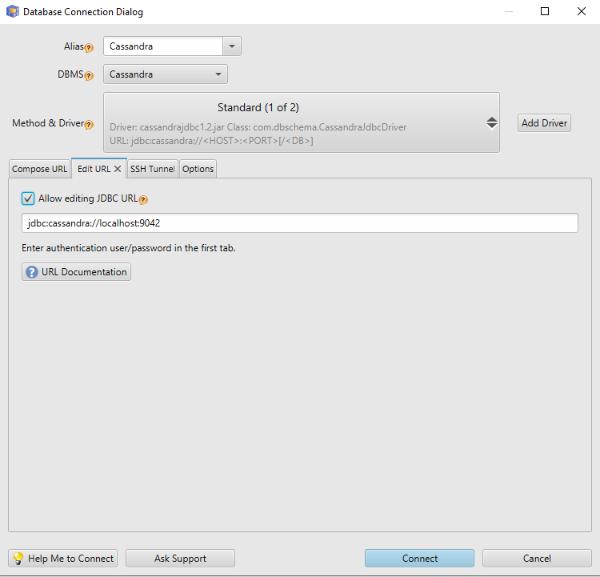
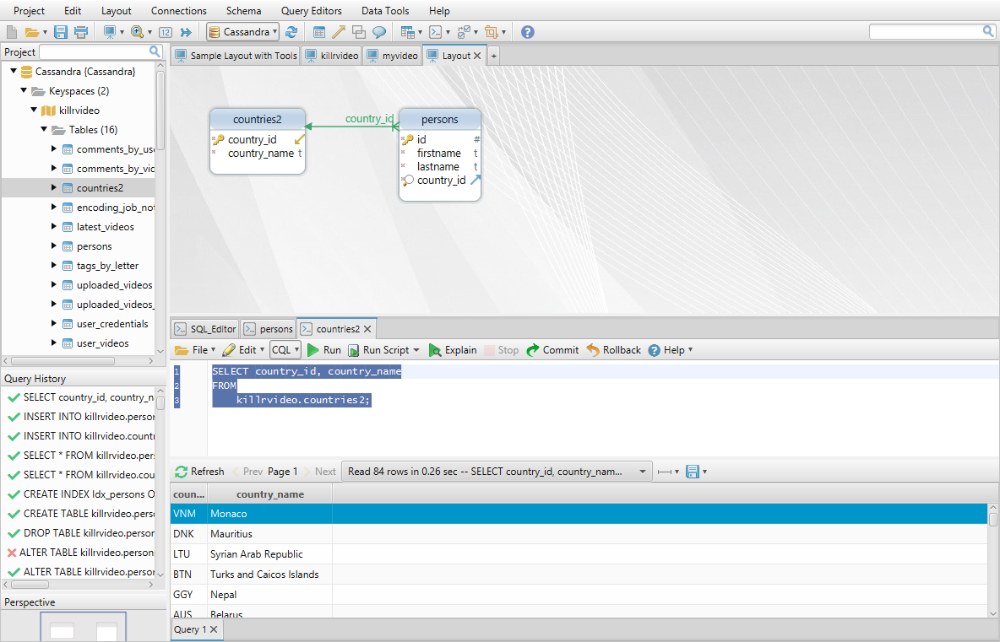
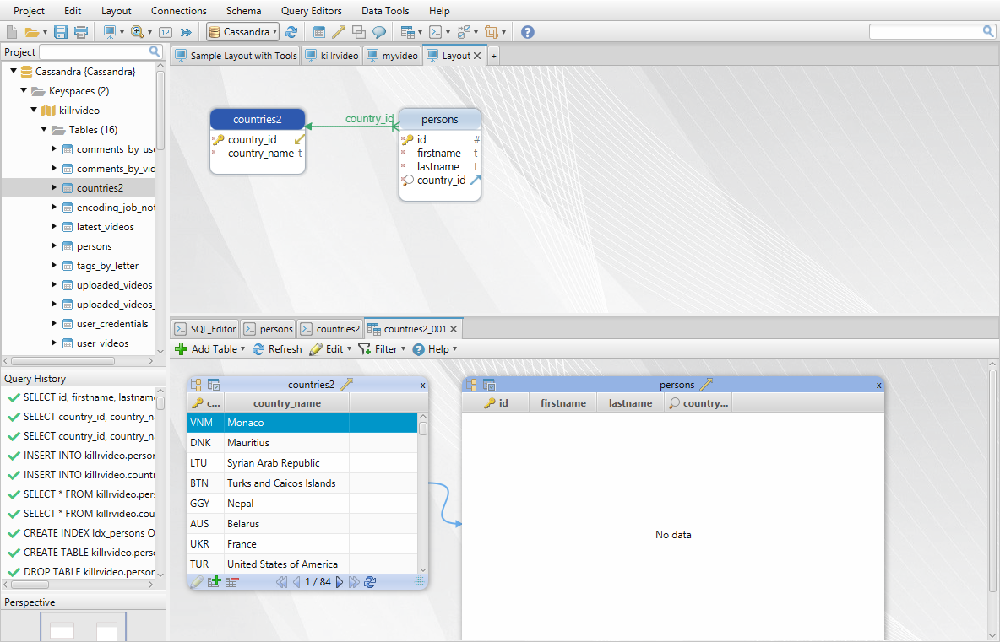
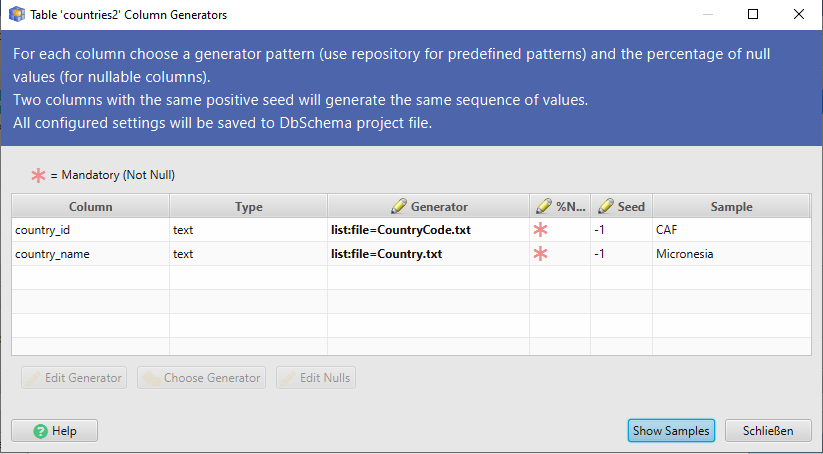

# Cassandra JDBC Driver | DbSchema Cassandra Designer

This is an open source JDBC Driver for Cassandra.
The driver is provided and used by [DbSchema Cassandra GUI Tool](https://dbschema.com).
The code is using few improvements done to the original code by DataGrip.

## Licensing

The driver is free to be used by everybody. Code changes are allowed only to this repository. Please improve the code and create pull requests, we will review and merge them in short time.
Alternatively you can create issues.

## Features

* Connect to Cassandra using the same JDBC URL as the native Cassandra Java driver
* Execute native Cql queries
* Implement of DatabaseMetaData methods for getting table, columns and index structure

## Downloading the Driver Binaries

[Available here](https://dbschema.com/jdbc-drivers/CassandraJdbcDriver.zip). Unpack and include all jars in your classpath. 

## How to Configure the JDBC Driver

* Java Driver Class: com.dbschema.CassandraJdbcDriver
* JDBC URL: jdbc:cassandra://host1[:port1][,host2[:port2],...[,hostN[:portN]]][/[keyspace][?options]]
* Website: [DbSchema](https://dbschema.com/cassandra-designer-tool.html)

The driver we wrote on top of the native [Cassandra Java Driver](https://github.com/datastax/java-driver)

## Connecting using SSL

For this set this URL parameters:

`javax.net.ssl.trustStore=/path/to/client.truststore&javax.net.ssl.trustStorePassword=password123&amp;`

If you're using client authentication:

`javax.net.ssl.keyStore=/path/to/client.keystore&javax.net.ssl.keyStorePassword=password123`

This parameters can be also set in DbSchema.vmoptions file like :

`-Djavax.net.ssl.trustStore=/path/to/client.truststore`

`-Djavax.net.ssl.trustStorePassword=password123`

If you're using client authentication:

`-Djavax.net.ssl.keyStore=/path/to/client.keystore`

`-Djavax.net.ssl.keyStorePassword=password123`

## How to Test the Driver

The driver can be tested by simply by [downloading DbSchema](https://dbschema.com). 
The tool can be evaluated 15 days for free.

DbSchema already include the Cassandra JDBC driver. You can simply connect to Cassandra and reverse engineer the schema.

Using the second tab you can enter a custom URL.

DbSchema can reverse engineer the schema and represent it as diagrams.

The Query Editor can be used for executing Cql Queries:

DbSchema can create virtual foreign keys, which are saved to project file.
They can be used in Relational Data Browse, to simply explore data from multiple tables.

Also a random data generator for Cassandra is available:

